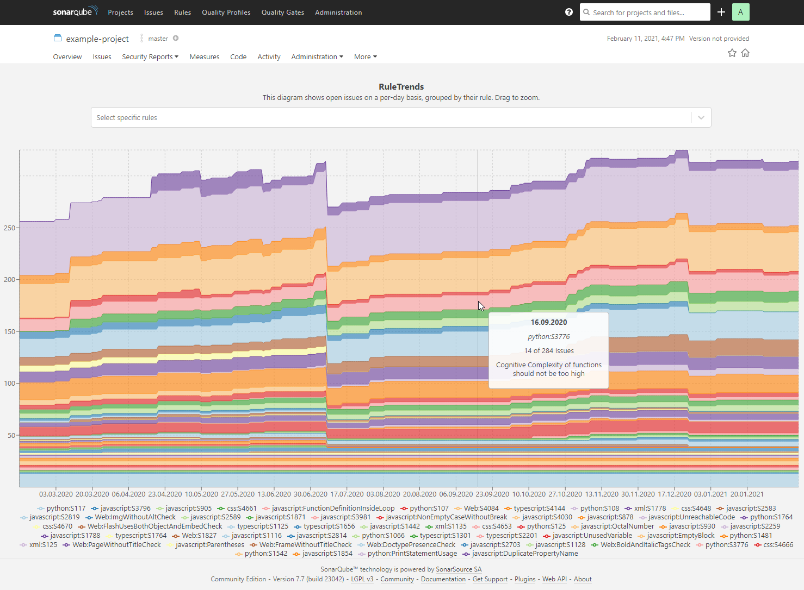
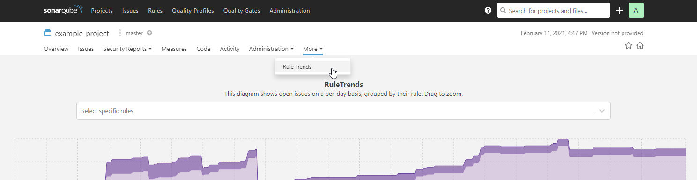

# ba-sonar-rule-trends

Practical part of the bachelor thesis RuleTrends, that allows a rule-level-based trend analysis of SonarQube issues

## General
ba-sonar-rule-trends is a project-page plugin for SonarQube, based on the official [SonarQube Custom Plugin Example](https://github.com/SonarSource/sonar-custom-plugin-example)
and is used to show a detailed history of issues grouped by their harmed rule.



## Setting up & running tests
After an initial ```npm install```, wiremock needs to be started by running

```
wiremock --port 9010
```

in the project root folder. Then, the integration environment needs to be started using

```
npm run int
```

Finally, tests can be started using

```
cypress run --headed
```

It is important to run the tests in headed mode, as image-snapshots
are used and headed vs headless produce slightly different results.
Also, it is important to not move the mouse inside the diagram area
during tests, as e.g. the tooltip on a different position could
cause tests to fail.

## Installation on SonarQube instance
This source code first needs to be compiled and packaged using maven:

```
mvn clean package
```

This produces a *.jar package in the folder ```target```, e.g. ```sonar-ruletrends-plugin-1.0-SNAPSHOT.jar```,
which needs to be copied into a specific folder of the SonarQube installation, namely

```
/opt/sonarqube/extensions/_data/plugins
```

After that, the SonarQube instance needs to be restarted in order to load the plugin. The plugin is
accessible in the "More"-menu of a project page.


